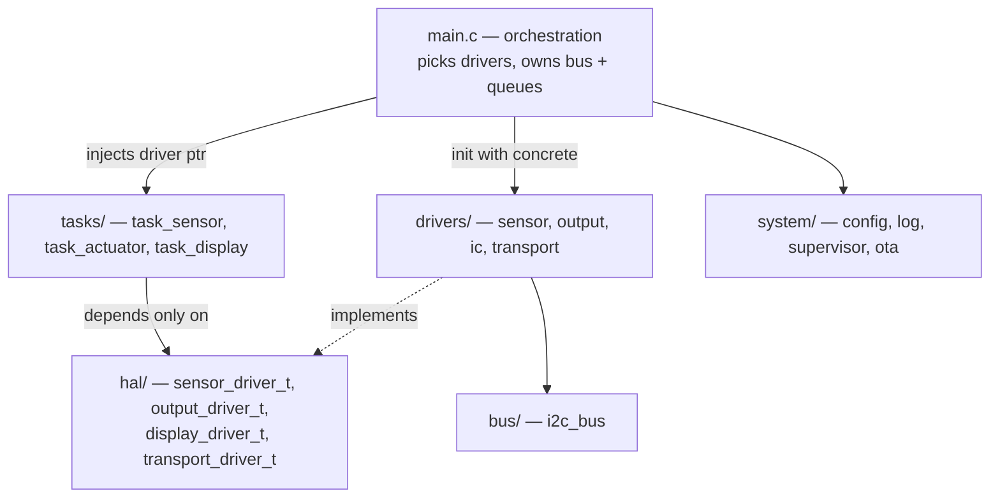

# Fortune Labs Mainboard Firmware — Architecture

ESP-IDF and FreeRTOS firmware for the Fortune Labs Mainboard (ESP32-S3).

This document is the architectural reference: the layer map, the rules that keep
the layers apart, and the reasoning behind the design choices. For getting the
repository as a whole, see the [root README](../README.md).

## The core idea

Business logic never names a chip. Every task depends on a **HAL contract** — a
vtable struct in `main/hal/` — and never on the driver behind it. `main.c` is the
only file that knows which concrete driver is in play, and it wires them together
at boot.

The payoff: swapping the dummy LED output for an MCP23017 + ULN2803A relay bank
means changing one line in `main.c`. Nothing inside `task_actuator.c` changes.



The dotted line matters. Tasks point *down* at contracts; drivers point *up* to
satisfy them. No task ever includes a driver header.

## Layers

| Layer | Directory | Responsibility | May depend on |
|---|---|---|---|
| Orchestration | `main.c` | Boot sequence, driver selection, queue allocation, command routing | everything |
| Task | `tasks/` | Periodic work, business logic | `hal/`, `common/` |
| HAL contract | `hal/` | Interface definitions only, no implementation | `bus/` (for config shapes) |
| Driver | `drivers/` | Concrete hardware, split `sensor/ output/ ic/ transport/` | `hal/`, `bus/` |
| Platform | `bus/` | Shared I2C master, device registration, scan | ESP-IDF |
| System | `system/` | NVS config, logging, watchdog + heartbeat, OTA | ESP-IDF |

## Design decisions

### 1. IC drivers keep an internal vtable

`ads1115` and `mcp23017` expose `ads1115_driver_t` + `ads1115_get_driver()`
rather than plain public functions, so there are effectively two vtable levels:
the HAL contract on the outside, the IC driver's own on the inside.

This was challenged. The de-vtable refactor was fully implemented — flat public
functions, tests calling them directly — and then **reverted**, because the flat
drivers proved harder to read day to day. The inner vtable is the house style by
deliberate choice, not by accident.

Two things were kept from that reverted work: the ADS1115 clock now comes from
`config->scl_hz` instead of a hardcoded 100 kHz, and internal static helpers keep
leading-underscore names.

### 2. Drivers are injected, never included

Each task receives a `*_ctx_t` through `xTaskCreate`'s `pvParameters`, holding a
contract pointer that `main.c` assigned:

```c
g_task_display_ctx.driver = &ssd1306_driver;
xTaskCreate(task_display, "task_display", 3072, &g_task_display_ctx, 4, NULL);
```

`task_display.c` originally included a concrete driver header. It now consumes an
injected `display_driver_t`, which is what makes the display swappable without
touching task code. Contexts are `static` because the task reads through the
pointer for its whole lifetime.

### 3. Networking sits behind a transport contract

`network_manager` is wrapped by a `transport_driver_t` adapter rather than being
called directly. Callers reach outbound comms only through the contract, so
moving from WiFi/MQTT to cellular or LoRaWAN changes the driver instance wired in
`main.c`, not the call sites.

`transport_config_t` deliberately has a different shape from the other contracts
— no `i2c_bus_t *`, since transport rides the radio rather than the I2C bus.

### 4. Command interpretation belongs to orchestration

`app_transport_command()` in `main.c` parses the inbound broker payload and pushes
the resulting state onto the actuator queue. The transport driver moves bytes; it
does not know what they mean. This kept protocol semantics out of the driver when
command routing moved up out of `network_manager`.

### 5. Contracts describe capability, not hardware

Each interface is deliberately generic where hardware would otherwise leak
through:

- `display_show_text()` uses **row addressing**, like a terminal, not pixel
  coordinates — the same contract fits an OLED and a character LCD.
- Output channels are **0-indexed logical numbers**. Mapping channel 0 to
  `MCP23017 GPA0 -> ULN2803A IN1 -> Relay 1` is internal to the driver.
- `sensor_reading_t.value` is a bare `float`. Whether it means volts, °C, or ppm
  is the concrete driver's business.

### 6. Tasks communicate through queues, not shared state

`g_queue_display` carries `display_msg_t`, `g_queue_actuator` carries `bool`.
Producers never call into consumer tasks. `main.c` owns the queues and aborts the
boot if allocation fails.

## Adding a new driver

1. Pick the contract in `hal/` your device satisfies. Do not add a new contract
   unless no existing one fits.
2. Implement it under the matching `drivers/` subdirectory, exposing a single
   `const <type>_driver_t <name>_driver` symbol.
3. Add the `.c` file to `SRCS` in `main/CMakeLists.txt`.
4. Wire it in `main.c` — init with a config struct, assign the pointer into the
   task context.
5. Add a host-native test under `test/`, mocking the bus via `mock_i2c_bus.c`.

If step 4 requires touching anything in `tasks/`, the abstraction has leaked.

## Boot sequence

`app_main()` runs strictly in this order; each step assumes the previous
succeeded.

```
 1. NVS init (erase + retry on version mismatch)
 2. Logging
 3. Config load from NVS
 4. OTA rollback check — mark running image valid
 5. I2C bus init + pre-flight scan
 6. Queue allocation
 7. Driver init, contract pointers wired into task contexts
 8. Transport init (WiFi + MQTT)
 9. Supervisor init (watchdog + heartbeat)
10. Task spawn
```

Priorities: supervisor 6, sensor 5, actuator 5, display 4.

## Configuration

Build-time options via Kconfig (`idf.py menuconfig`). Runtime configuration is
persisted in NVS, with Kconfig as fallback.

## Building and testing

```bash
idf.py set-target esp32s3
idf.py build
idf.py -p /dev/ttyACM0 flash monitor      # Ctrl+] to exit
```

Port naming depends on the USB-serial chip: CH343/CH9102 enumerates as
`/dev/ttyACM0`, CH340/CP210x as `/dev/ttyUSB0`.

Host-native unit tests need no hardware:

```bash
pio test -e native
```

## Known deviations

Tracked here rather than in a separate file so it stays honest.

- **The committed `sdkconfig` targets `esp32`, but the board is an
  ESP32-S3-WROOM-2** (U3 in the hardware BOM). CI builds `esp32` too. The
  `sdkconfig` is stale from the `hello_world` template this project was
  initialized from, and running `idf.py set-target esp32s3` rewrites it.
- **`ota_test_task` in `main.c` is R&D scaffolding** — it fires an OTA at a
  hardcoded LAN address 10 seconds after boot, with `skip_cert_check` enabled.
  Remove before production.
- **`main.c` injects fallback WiFi and broker credentials** when NVS is blank.
  Replace with a provisioning flow before production.
- **`components/ssd1306/` is compiled but unused.** The active display driver is
  `main/drivers/ic/ssd1306.c`; the vendored component is kept for a possible
  future migration. See [NOTICE](../NOTICE) for its MIT attribution.
